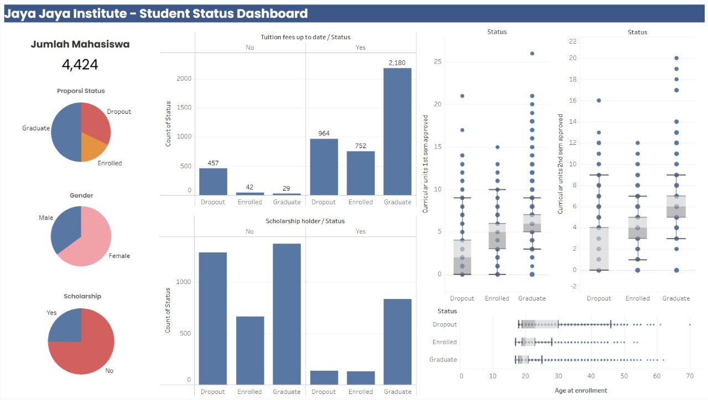
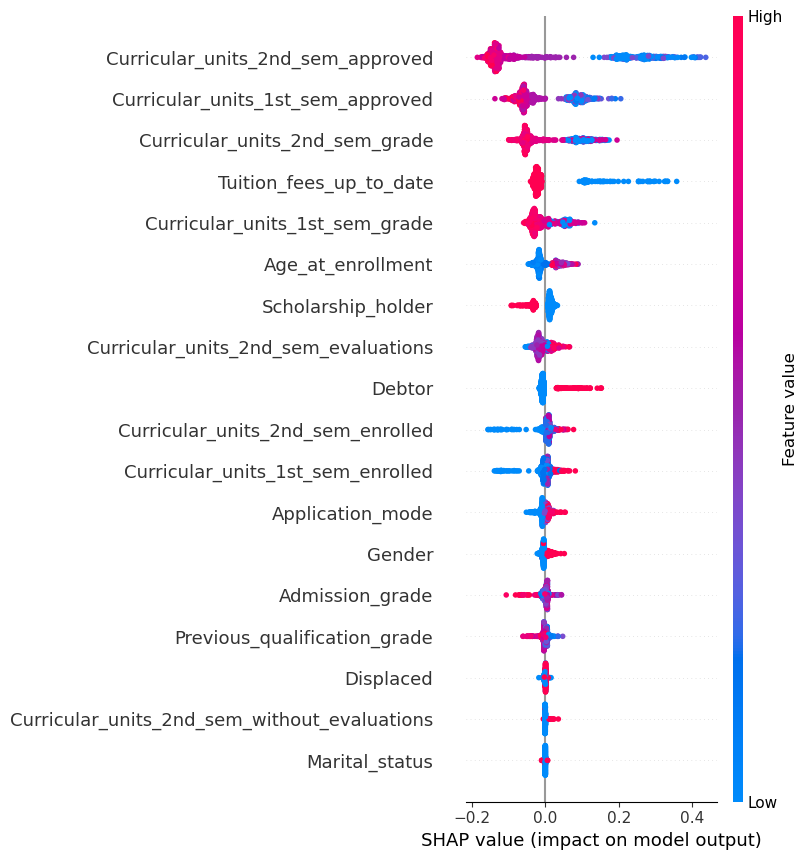

# Proyek Akhir: Menyelesaikan Permasalahan Institusi Pendidikan

- **Nama:** Naufal Fadli Muzakki
- **Email:** 222112245@stis.ac.id
- **ID Dicoding:** nf_muzakki

## Business Understanding

Jaya Jaya Institut merupakan salah satu institusi pendidikan tinggi yang telah berdiri sejak tahun 2000. Selama lebih dari dua dekade, institusi ini berhasil meluluskan banyak mahasiswa dengan reputasi yang sangat baik. Namun, dalam perjalanannya, masih terdapat cukup banyak mahasiswa yang tidak menyelesaikan studi mereka atau mengalami dropout.

Tingginya angka dropout ini menjadi permasalahan serius karena dapat memengaruhi reputasi institusi, menurunkan tingkat akreditasi, serta mengurangi kepercayaan masyarakat terhadap kualitas pendidikan yang diberikan. Oleh karena itu, pihak institusi ingin segera mengidentifikasi mahasiswa yang berpotensi dropout agar bisa diberikan intervensi atau bimbingan secara dini.

Sebagai calon data scientist, Anda diminta untuk membantu menyelesaikan permasalahan ini melalui pendekatan data science, dengan tujuan utama meningkatkan tingkat kelulusan mahasiswa dan menjaga kualitas institusi.

### Permasalahan Bisnis

Tingginya angka dropout di Jaya Jaya Institut menimbulkan berbagai tantangan, antara lain:

* Penurunan reputasi dan akreditasi institusi pendidikan.
* Berkurangnya tingkat kepercayaan masyarakat terhadap institusi.
* Terhambatnya upaya pembinaan dan pemberian bantuan kepada mahasiswa secara tepat waktu.
* Risiko berkurangnya daya saing institusi di tengah kompetisi dunia pendidikan yang semakin ketat.

Untuk itu, diperlukan sistem prediksi yang dapat mengidentifikasi mahasiswa yang berpotensi dropout sedini mungkin. Dengan begitu, institusi dapat mengambil langkah intervensi yang lebih efektif untuk mencegah dropout dan meningkatkan performa akademik mahasiswa secara keseluruhan.

### Cakupan Proyek

Lingkup pekerjaan yang akan dilakukan dalam proyek ini adalah sebagai berikut:

1. **Data Preparation dan Data Cleaning**
   Melakukan pembersihan dan persiapan data yang diberikan agar siap digunakan dalam proses analisis dan pemodelan.

2. **Exploratory Data Analysis (EDA)**
   Mengeksplorasi data melalui visualisasi dan statistik deskriptif untuk mengidentifikasi pola, tren, serta faktor-faktor yang memengaruhi tingkat dropout mahasiswa.

3. **Pembuatan Dashboard**
   Mengembangkan minimal satu dashboard interaktif menggunakan tools seperti Metabase, Looker Studio, atau Tableau Public untuk mempermudah pemantauan performa mahasiswa.

4. **Pengembangan Model Machine Learning**
   Membangun model prediksi menggunakan algoritma machine learning untuk mengklasifikasikan status mahasiswa (dropout atau tidak) berdasarkan variabel-variabel yang tersedia.

5. **Deployment Model**
   Melakukan deployment model dalam bentuk aplikasi prototype menggunakan Streamlit dan meng-host-nya di Streamlit Community Cloud agar dapat diakses secara online oleh pihak institusi.

6. **Pemberian Rekomendasi (Action Items)**
   Memberikan saran dan rekomendasi yang actionable berdasarkan hasil analisis dan model untuk membantu institusi menurunkan angka dropout.


### Persiapan

**Data source:** [Students' Performance data](https://github.com/dicodingacademy/dicoding_dataset/blob/main/students_performance 'Dicoding GitHub - Students Performance data')

**Setup environment:**
1. Create Python Virtual Environment
   ```bash
   virtualenv venv
   ```

2. Activate the Environment
   ```bash
   venv\Scripts\activate
   ```

3. Install All the Requirements Inside "requirements.txt"
   ```bash
   pip install -r requirements.txt
   ```

## Business Dashboard

[Jaya Jaya Institute Students Dashboard](https://public.tableau.com/views/StudentStatusDashboard-JayaJayaInstitute/Dashboard1?:language=en-US&:sid=&:redirect=auth&:display_count=n&:origin=viz_share_link 'Tableau Public- Jaya Jaya Institute Students Dashboard'), didesain sefektif mungkin untuk memberikan insight bagi para pengajar dan pihak internal institusi mengenai masalah tingkat siswa dropout yang mencapai lebih dari 30%. Dashboard ini juga didesain dengan visualisasi dan pemilihan warna yang inklusif bagi penderita color blind.

<figure>
  
</figure>

Dashboard ini dibangun berdasarkan hasil eksplorasi data dan validasi feature importance melalui model **Random Forest**, dengan analisis interpretabilitas menggunakan **SHAP values**. Seluruh variabel yang ditampilkan di visualisasi merupakan faktor yang secara signifikan memengaruhi prediksi dropout pada siswa menurut hasil model dan hasil eksplorasi data.

### Insight Visualisasi pada Dashboard

#### 📊 Jumlah dan Proporsi Mahasiswa

* **Total Mahasiswa**: 4.424 orang.
* **Proporsi Status**:

  * **Lulus (Graduate)**: Mayoritas mahasiswa.
  * **Dropout**: Cukup signifikan.
  * **Masih Aktif (Enrolled)**: Sebagian kecil populasi.

#### 💰 Status Pembayaran UKT (Tuition Fees)

* Mahasiswa yang **tidak membayar UKT tepat waktu** cenderung mengalami **dropout**.
* Sebaliknya, **mayoritas lulusan membayar UKT tepat waktu**.

#### 🎓 Beasiswa

* Mahasiswa **tanpa beasiswa** mendominasi kasus dropout.
* Mahasiswa **dengan beasiswa** lebih cenderung menyelesaikan studi.

#### 📚 Performa Akademik

* Rata-rata **jumlah mata kuliah yang disetujui di semester 1 dan 2** lebih rendah pada mahasiswa dropout dibandingkan yang lulus.
* Ini menunjukkan bahwa **rendahnya performa akademik di awal perkuliahan menjadi indikator penting dropout**.

#### 👤 Umur Saat Masuk Kuliah

* Mahasiswa dengan usia **lebih muda (sekitar 17–22 tahun)** lebih cenderung berhasil lulus.
* **Dropout lebih banyak terjadi pada mahasiswa usia lebih tua** saat mulai kuliah, menunjukkan potensi tantangan adaptasi atau beban luar kampus.

> [!NOTE]
> Video singkat penjelasan business dashboard dan kesimpulannya dapat dilihat pada [link YouTube ini](https://youtu.be/j1DGjhtVrqA 'Jaya Jaya Institute - Student Status Dashboard').

## Model Interpretability

Berdasarkan **SHAP summary plot** berikut:

<figure>
  
</figure>

variabel yang paling berpengaruh terhadap prediksi **dropout mahasiswa**:

| Rank | Fitur                                     | Insight SHAP Value                                                                   |
| ---- | ----------------------------------------- | ------------------------------------------------------------------------------------ |
| 1    | **Curricular\_units\_2nd\_sem\_approved** | Makin sedikit mata kuliah yang disetujui di semester 2, makin tinggi risiko dropout. |
| 2    | **Curricular\_units\_1st\_sem\_approved** | Performa awal (semester 1) sangat menentukan kelulusan.                              |
| 3    | **Curricular\_units\_2nd\_sem\_grade**    | Nilai semester 2 yang rendah meningkatkan risiko dropout.                            |
| 4    | **Tuition\_fees\_up\_to\_date**           | Mahasiswa yang menunggak UKT lebih berpotensi dropout.                               |
| 5    | **Curricular\_units\_1st\_sem\_grade**    | Nilai rendah di semester awal jadi sinyal potensi tidak lanjut studi.                |
| 6    | **Age\_at\_enrollment**                   | Usia masuk yang lebih tinggi berkorelasi dengan kemungkinan dropout lebih tinggi.    |
| 7    | **Scholarship\_holder**                   | Pemegang beasiswa lebih jarang dropout.                                              |

**Catatan Tambahan**:

* Fitur lain seperti **Debtor**, **Jumlah Evaluasi**, dan **Curricular\_units\_enrolled** juga berkontribusi tetapi tidak sebesar fitur akademik dan keuangan.


## **Menjalankan Sistem Machine Learning**

Untuk dapat membantu institusi dalam memprediksi kemungkinan jika siswanya akan dropout dan mencegah hal tersebut lebih dini, dapat menggunakan sistem prediksi yang telah dibangun. Sistem dibangun menggunakan Streamlit dan untuk menjalankan sistem tersebut secara local, dapat menjalankan kode berikut pada Terminal,

**To run the Streamlit prediction:**
```bash
streamlit run streamlit_app.py
```

And to stop the streamlit application program by `ctrl + c`. 

Sistem prediksi tersebut juga dapat diakses secara langsung yang sudah di-deploy ke Streamlit Cloud melalui tautan [berikut ini](https://jaya-jaya-student-status.streamlit.app).

## Conclusion

1. **Kinerja akademik awal** (jumlah mata kuliah yang disetujui dan nilai) adalah indikator paling kuat untuk dropout.
2. **Tunggakan UKT** menjadi sinyal risiko dropout yang sangat penting.
3. **Mahasiswa yang lebih tua saat masuk kuliah** lebih berisiko tidak menyelesaikan studi.
4. **Beasiswa** dapat menjadi alat bantu retensi karena berkorelasi positif dengan kelulusan.

### Rekomendasi Action Items

1. **Intervensi Dini Akademik**: Pantau performa semester 1 & 2 secara intensif. Berikan pendampingan bagi yang nilainya rendah.
2. **Monitoring Pembayaran UKT**: Buat sistem peringatan dini bagi mahasiswa yang menunggak.
3. **Program Bimbingan Mahasiswa Dewasa**: Sediakan dukungan adaptasi khusus bagi mahasiswa yang masuk di usia lebih tua.
4. **Perluas Akses Beasiswa**: Meningkatkan akses terhadap beasiswa bisa membantu retensi.
5. **Integrasi Model ke Sistem Akademik**: Gunakan model prediksi dropout untuk memberi alert kepada dosen wali atau konselor.